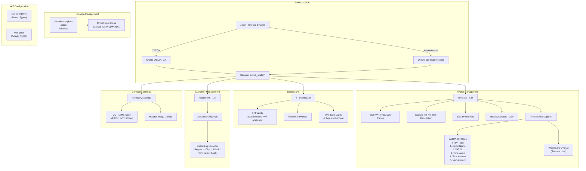
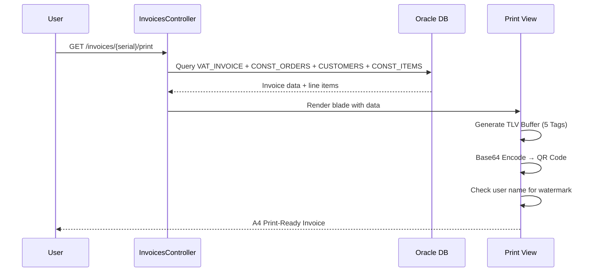

# WamelevatorVAT - Project Overview

**WamelevatorVAT** is a **Laravel 10** ZATCA-compliant e-invoicing system for **Abdul Ghani Hussein Hamid Elevators Company** (Saudi Arabia). It connects to **Oracle 10g** to manage VAT invoices, customers, locations, and company settings with a full Arabic/English admin dashboard.

---

## Key Modules

| Module | Description |
|---|---|
| **Dual Auth** | Login switches between ZATCA and Wamelevator ERP databases dynamically |
| **Dashboard** | KPIs (total invoices, VAT amounts), recent invoices, VAT type cards |
| **Invoices** | Filterable/sortable list, print view with ZATCA QR code (5 TLV tags), CSV export |
| **VAT Types/Categories** | Card listings with invoice counts, click to filter |
| **Customers** | CRUD with location cascading (region → city → district) |
| **Locations** | Saudi regions, cities, districts management |
| **Company Settings** | Editable company info with image upload |
| **Watermark** | Review/audit watermark overlay for certain users |

---

## Tech Stack

| Technology | Version/Detail |
|---|---|
| **PHP** | 8.1.10 (Laragon) |
| **Laravel** | 10.x |
| **Database** | Oracle 10g (via PHP `pdo_oci` extension) |
| **Oracle Instant Client** | 11.1.0.7.0 |
| **Frontend** | Sneat Bootstrap 5 HTML Admin Template (free) |
| **JS Libraries** | jQuery, Popper.js, Perfect Scrollbar, Boxicons, Tom Select, QR Code Generator |
| **Composer** | `laravel/framework` ^10.10, `yajra/laravel-oci8` ^10.0, `doctrine/dbal` ^3.6, `guzzlehttp/guzzle` ^7.2, `laravel/sanctum` ^3.3 |
| **Build Tools** | Vite ^5.0, Laravel Vite Plugin |
| **Auth** | Custom `OracleUserProvider` (plain-text + bcrypt) |
| **Locale** | Arabic (primary) and English, RTL/LTR support |

---

## Architecture

### Directory Structure

```
Zatca_invoice/
├── app/
│   ├── Auth/
│   │   └── OracleUserProvider.php      # Custom auth provider
│   ├── Database/
│   │   ├── OracleConnection.php        # Custom DB connection
│   │   ├── OracleConnector.php         # PDO_OCI DSN builder
│   │   ├── OracleQueryGrammar.php      # Oracle SQL grammar (ROWNUM)
│   │   ├── OracleSchemaGrammar.php     # Oracle DDL grammar
│   │   └── OracleProcessor.php         # Result processor
│   ├── Http/Controllers/
│   │   ├── AuthController.php          # Login with system selection
│   │   ├── DashboardController.php     # KPIs & summaries
│   │   ├── InvoicesController.php      # Invoice CRUD, export, print
│   │   ├── CustomerController.php      # Customer management
│   │   ├── LocationController.php      # Regions/cities/districts CRUD
│   │   ├── CompanySettingController.php
│   │   ├── VatTypesController.php
│   │   ├── VatCategoriesController.php
│   │   ├── LocaleController.php        # Language switcher
│   │   ├── SystemSelectController.php  # System switcher
│   │   └── LCETablesController.php     # Oracle table browser (disabled)
│   ├── Models/
│   │   ├── User.php, VatInvoice.php, VatType.php, VatCategory.php
│   │   ├── Customer.php, Region.php, City.php, District.php
│   │   ├── CompanySetting.php          # Non-Eloquent, file+Oracle-backed
│   │   └── LCE_Tables.php
│   └── Providers/
│       ├── AppServiceProvider.php      # Registers oracle driver + auth
│       ├── AuthServiceProvider.php
│       ├── BroadcastServiceProvider.php
│       ├── EventServiceProvider.php
│       └── RouteServiceProvider.php
├── config/
│   ├── app.php                        # locale: ar, timezone: Asia/Riyadh
│   ├── auth.php                       # provider: oracle-users
│   └── database.php                   # oracle + wamelevator connections
├── database/
│   ├── migrations/                    # Laravel stock migrations
│   ├── oracle/                        # DDL scripts
│   └── seeders/                       # Database seeders
├── resources/views/
│   ├── layouts/app.blade.php          # Main admin layout (Sneat)
│   ├── auth/login.blade.php           # Dual-system login
│   ├── dashboard.blade.php
│   ├── invoices/index.blade.php       # With filters/sorting/pagination
│   ├── invoices/print.blade.php       # With QR code & watermark
│   ├── customers/index.blade.php
│   ├── customers/edit.blade.php
│   ├── company/settings.blade.php
│   └── locations/{regions,cities,districts}.blade.php
├── routes/web.php                     # All web routes
├── invoice-form.html                  # Standalone HTML invoice form
├── invoice.html                       # Standalone HTML invoice viewer
└── overview.md
```

---

## Database Tables (Oracle 10g)

| Table | Purpose |
|---|---|
| `VAT_INVOICE` | Main invoice data (SERIAL, TR_NO, TRANS_DATE, VAT_ID, V_CAT_ID, amounts, etc.) |
| `VAT_TYPES` | 7 VAT activity types with icons |
| `VAT_CATEGORIES` | VAT categories with rates |
| `USERS` | Legacy users (plain-text + bcrypt passwords) |
| `CUSTOMERS` | Customer records with location/district |
| `CO_NAME` | Singleton company settings |
| `CONST_ORDERS` | Orders linked to invoices |
| `CONST_ITEMS` | Invoice line items |
| `ITEMS` | Item catalog |
| `CHART_OF_ACCOUNT` | Account chart |
| `REGIONS` / `CITIES` / `DISTRICTS` | Saudi location hierarchy |

---

## Invoice Workflow



### Invoice Print Sequence



---

## Notable Patterns

1. **Custom Oracle Driver** — Full custom `pdo_oci`-based Oracle driver (`OracleConnection`, `OracleConnector`, `OracleQueryGrammar`, `OracleSchemaGrammar`, `OracleProcessor`) registered via `Connection::resolverFor('oracle', ...)`.

2. **Dual-System Runtime DB Switching** — `AuthController::login()` dynamically changes Oracle connection config to point to ZATCA or Wamelevator DB using separate env keys.

3. **Legacy Password Compatibility** — `OracleUserProvider` tries plain-text comparison first, then falls back to bcrypt `password_verify()`.

4. **Manual Pagination** — Uses Oracle's classic `ROWNUM` two-layer subquery pattern (no `OFFSET/FETCH` in Oracle 10g).

5. **Oracle MERGE for Upsert** — `CompanySetting::update()` uses `MERGE INTO` for insert-or-update.

6. **ZATCA TLV QR Encoding** — Implements the 5 required TLV tags (seller name, VAT no, timestamp, total, VAT amount) → Base64 → QR code.

7. **Watermark Overlay** — Conditional semi-transparent "غير رسمية/للمراجعة" watermark for specific users.

8. **Session-Based System State** — Active system stored in session, influences query filters and company defaults.

9. **Tom Select Cascading** — AJAX-powered cascading region → city → district selects.

10. **Non-Eloquent Model** — `CompanySetting` is a plain PHP class (not Eloquent) with file-backed JSON fallback per system.
