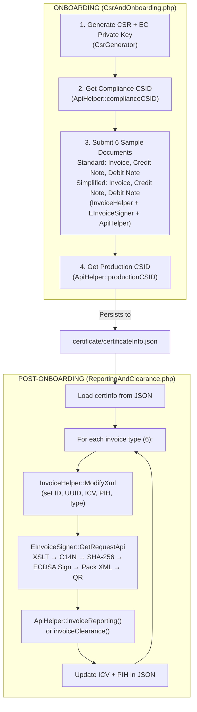
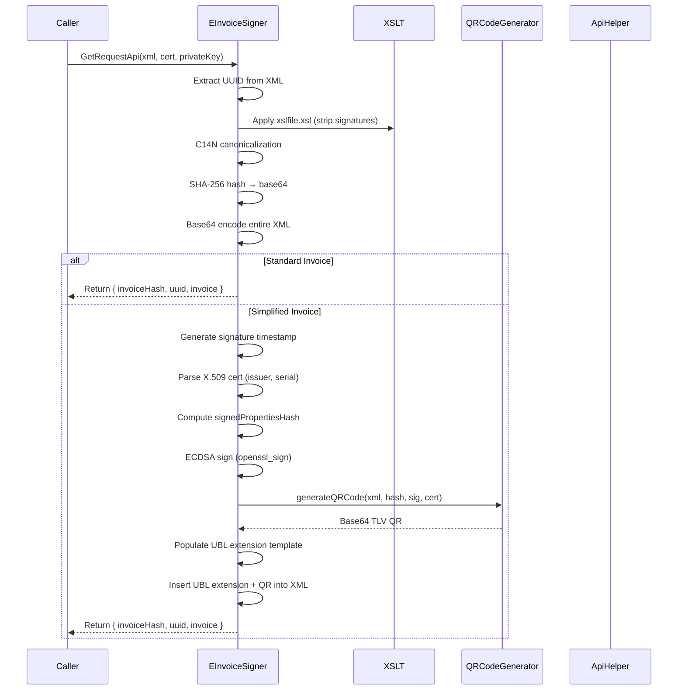

# ZatcaPHP — ZATCA Phase 2 E-Invoicing Integration

**ZatcaPHP** is a standalone PHP library for **Saudi ZATCA Phase 2 e-invoicing** (device onboarding, certificate management, invoice signing, QR generation, and API reporting/clearance). It is located at `Zatca_invoice/ZatcaPHP/`.

---

## Directory Structure

```
ZatcaPHP/
├── CsrAndOnboarding.php              # Entry: device onboarding (4 steps)
├── ReportingAndClearance.php         # Entry: post-onboarding invoice submission
├── Helpers/
│   ├── ApiHelper.php                 # cURL client for all ZATCA APIs
│   ├── CsrGenerator.php              # EC secp256k1 key pair + CSR generation
│   └── InvoiceHelper.php             # XML manipulation (modify, extract hash/QR)
├── Signer/
│   ├── EInvoiceSigner.php            # Invoice signing orchestrator
│   └── QRCodeGenerator.php           # ZATCA-compliant TLV QR code generator
├── Resources/
│   ├── Invoice.xml                   # Base UBL 2.1 invoice template
│   ├── ZatcaDataUbl.xml              # UBL extension signature template
│   ├── ZatcaDataSignature.xml        # QR + signature fragment
│   └── xslfile.xsl                   # XSLT to strip signatures during canonicalization
├── certificate/
│   └── certificateInfo.json          # Persisted certificate + state (ICV, PIH)
└── README.md
```

---

## Main Classes

| Class | File | Key Methods | Purpose |
|---|---|---|---|
| `CsrGenerator` | `Helpers/CsrGenerator.php` | `generateCsr()`, `generatePrivateKey()` | EC secp256k1 key pair + CSR |
| `InvoiceHelper` | `Helpers/InvoiceHelper.php` | `ModifyXml()`, `ExtractInvoiceHashAndBase64QrCode()`, `updateCompanyIDInXmlTemplate()` | XML manipulation |
| `ApiHelper` | `Helpers/ApiHelper.php` | `complianceCSID()`, `complianceChecks()`, `productionCSID()`, `invoiceReporting()`, `invoiceClearance()`, `renewalCSID()` | cURL HTTP client with retry logic |
| `EInvoiceSigner` | `Signer/EInvoiceSigner.php` | `GetRequestApi()`, `SignSimplifiedInvoice()` | XSLT → C14N → SHA-256 → ECDSA sign → pack XML |
| `QRCodeGenerator` | `Signer/QRCodeGenerator.php` | `generateQRCode()` | TLV tags 1-9 → Base64 QR |

---

## ZATCA API Endpoints

| API | Method | Endpoint | Used In |
|---|---|---|---|
| Compliance CSID | POST | `/e-invoicing/{env}/compliance` | Onboarding Step 2 |
| Compliance Checks | POST | `/e-invoicing/{env}/compliance/invoices` | Onboarding Step 3 |
| Production CSID | POST | `/e-invoicing/{env}/production/csids` | Onboarding Step 4 |
| Invoice Reporting | POST | `/e-invoicing/{env}/invoices/reporting/single` | Post-onboarding (simplified) |
| Invoice Clearance | POST | `/e-invoicing/{env}/invoices/clearance/single` | Post-onboarding (standard) |

Where `{env}` is one of: `developer-portal`, `simulation`, `production`.

---

## Workflow

### Onboarding (`CsrAndOnboarding.php`)



### Invoice Signing Pipeline (`EInvoiceSigner`)



### QR Code TLV Structure

| Tag | Value | Example |
|---|---|---|
| 1 | Seller Name | `شركة عبد الغني حسين حامد للمصاعد` |
| 2 | VAT Number | `399999999900003` |
| 3 | Timestamp (ISO 8601) | `2025-06-30T14:30:00Z` |
| 4 | Invoice Total | `115.00` |
| 5 | VAT Total | `15.00` |
| 6 | Invoice Hash (base64) | ... |
| 7 | ECDSA Signature (base64) | ... |
| 8 | ECDSA Public Key (base64) | ... |
| 9 | Certificate Signature (base64) | ... (simplified invoices only) |

---

## Technical Details

| Aspect | Details |
|---|---|
| **Dependencies** | No Composer — pure PHP with `require_once` |
| **PHP Extensions** | `openssl`, `curl`, `dom`, `xsl`, `simplexml`, `bcmath`, `mbstring` |
| **Authentication** | HTTP Basic Auth (`base64(binarySecurityToken:secret)`) |
| **API Version** | `Accept-Version: V2` |
| **Hash Algorithm** | SHA-256 |
| **Signature Algorithm** | ECDSA with secp256k1 curve |
| **Invoice Standard** | UBL 2.1 |
| **ICV/PIH Chaining** | Invoice Counter Value + Previous Invoice Hash for audit trail |
| **Origin** | [mabaega/ZatcaPHP](https://github.com/mabaega/ZatcaPHP) |

---

## Security Notes

- Private keys are stored in **plaintext** in `certificate/certificateInfo.json` — should be encrypted or moved to a secure vault in production
- Test data is hardcoded: company `TST-886431145-399999999900003`, OTP `123456`
- Environment is set via `$environmentType` variable (`NonProduction` / `Simulation` / `Production`)
